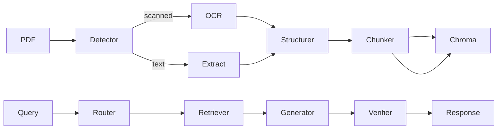

# 设计说明

## 1. 问题拆解

作业要求从扫描 PDF 到可靠问答的完整闭环。核心难点：

1. **扫描件无文本层**：必须 OCR，不能手工录入绕过。
2. **国标结构**：条款编号（3.1、3.5）与表1（AQL 验收）需结构化保留。
3. **可靠问答**：有依据、有引用、无证据则拒答。
4. **可测试可扩展**：评测脚本 + 插件化 Parser。

## 2. 架构

### 2.1 解析层 (`src/pdf/`)

| 模块 | 职责 |
|------|------|
| `PdfTypeDetector` | 统计各页可复制文本量，≥80% 低文本页判定为扫描件 |
| `OcrEngine` | PyMuPDF 渲染 + PaddleOCR，输出带 bbox 文本行 |
| `LayoutParser` | 分离正文与表格候选行 |
| `ClauseParser` | 正则识别条款编号，聚合条款内容 |
| `TableParser` | bbox 行聚类 → Markdown 表格 + 行级子块 |

**取舍**：未引入 MinerU，采用 OCR + 规则表格，4–6 小时内可交付且可解释。

### 2.2 索引层 (`src/indexing/`)

- `SemanticChunker`：条款/表格/段落块，长条款带 overlap 切分
- `EmbeddingClient`：OpenAI 兼容 Embedding API
- `DocumentIndexer`：Chroma 持久化 + text-embedding-v4 向量化
- `VectorRetriever`：纯向量检索，表格/条款 query 加权

### 2.3 问答层 (`src/agent/`)

| 模块 | 职责 |
|------|------|
| `QueryRouter` | 规则分类：表格/条款/超范围/通用 |
| `DocumentQAAgent` | 编排检索→生成→Verifier |
| `AnswerGenerator` | Evidence-only JSON 输出 |
| `AnswerVerifier` | 引用子串、数值、LLM grounding 三重校验 |

**拒答策略**：

- 检索分数低于阈值 → `REFUSE_NO_EVIDENCE`
- grounding=unsupported → `REFUSE_HALLUCINATION`
- partial + 低置信 → `REFUSE_INSUFFICIENT`

## 3. 技术选型

| 组件 | 选型 | 理由 |
|------|------|------|
| OCR | PaddleOCR | 中文扫描件成熟、本地免费 |
| PDF | PyMuPDF | 渲染快、依赖少 |
| 向量库 | Chroma | 本地持久化、原型友好 |
| 向量检索 | Chroma + text-embedding-v4 | DashScope 语义召回 |
| LLM | OpenAI 兼容 API | 用户指定，便于切换国内模型 |
| UI | Streamlit + Typer | 演示 + CLI 评测双入口 |

## 4. 边界处理

| 场景 | 策略 |
|------|------|
| OCR 错误 | 纠错词典 + 引用模糊匹配 |
| 无答案题 | 检索阈值 + out_of_scope 路由 + 拒答 |
| API 失败 | 向量检索失败时返回空结果并拒答 |
| 表格跨页 | 按页生成 table block，检索时语义合并 |

## 5. 扩展性

`src/plugins/base.py` 定义 `DocumentParser` 协议。新业务接入步骤：

1. 实现领域 Parser（合同/财报/合规）
2. 增加 `config/domains/*.yaml` 配置 chunk 策略
3. 补充领域 golden_qa 评测集

**金融/合规增强路线**：

- 审计日志：持久化检索快照与模型版本
- 双 Verifier 投票
- 文档级 ACL 与 PII 脱敏
- 低置信答案进入人工复核队列

## 6. 完成度说明

| 项目 | 状态 |
|------|------|
| PDF 类型检测 | ✅ |
| OCR + 条款切分 | ✅ |
| 表1 表格结构化 | ✅（规则方案） |
| 混合检索 RAG | ✅ |
| 引用 + 自检拒答 | ✅ |
| CLI + Streamlit | ✅ |
| 自动化评测 | ✅ |
| 演示视频 | ⏳ 需用户本地录制 |

**未完成/可加强**：Reranker、MinerU 表格、多 PDF 会话、澄清追问。
